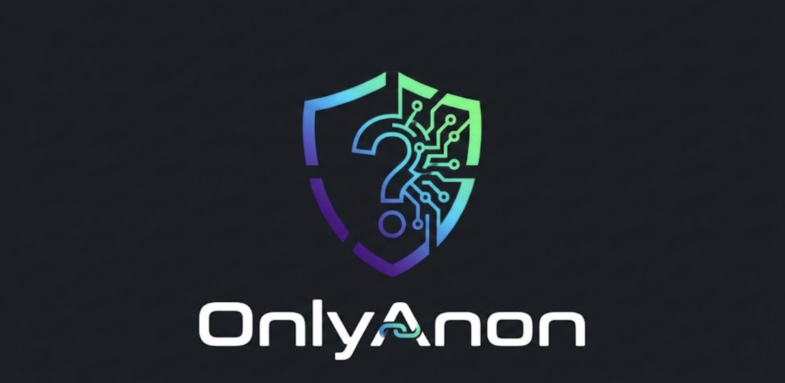

<p align="center">
  
</p>

<p align="center">
  <strong>Get paid for anonymous questions.</strong>
</p>

--- A privacy-first Q&A platform where fans pay creators to ask questions while remaining completely anonymous through zero-knowledge proofs on Solana.

## Overview

OnlyAnon bridges the gap between creator monetization and fan privacy. Creators sign in with Twitter/X and set up paid Q&A offerings. Fans can ask questions and pay using SOL or USDC, with their wallet addresses completely hidden from creators through the ShadowWire protocol.

### Key Features

- **Anonymous Payments** - Fan wallet addresses are hidden using zero-knowledge proofs via ShadowWire
- **Creator Profiles** - Twitter-verified creators with customizable Q&A offerings
- **Flexible Pricing** - Creators set their own prices in SOL or USDC
- **Access Code System** - Fans receive a unique code (XXXX-XXXX-XXXX) to check replies without revealing identity
- **Creator Dashboard** - Manage offerings, view questions, and send replies
- **Creator Directory** - Browse and discover creators accepting anonymous questions

## How It Works

1. **Creators** sign in with Twitter/X via Privy, which automatically creates a Solana wallet
2. **Creators** set up Q&A offerings with custom titles, descriptions, and prices
3. **Fans** browse creators, select an offering, and write their question
4. **Fans** pay anonymously using ShadowWire - their wallet address is never exposed
5. **Fans** receive an access code to check for replies later
6. **Creators** view and reply to questions in their dashboard
7. **Fans** use their access code at `/check` to view the creator's response

## Tech Stack

| Layer | Technology |
|-------|------------|
| Framework | Next.js 16 (App Router) |
| Language | TypeScript |
| Styling | Tailwind CSS 4, Framer Motion |
| UI Components | Radix UI (shadcn/ui) |
| Authentication | Privy (Twitter/X + Solana wallet) |
| Database | Supabase (PostgreSQL) |
| Blockchain | Solana |
| Privacy Protocol | ShadowWire (zero-knowledge proofs) |
| State Management | TanStack React Query |

## Project Structure

```
src/
├── app/                      # Next.js App Router
│   ├── page.tsx              # Landing page
│   ├── login/                # Authentication
│   ├── creators/             # Creator directory
│   ├── check/                # Reply verification
│   ├── [username]/           # Creator profiles & question forms
│   ├── dashboard/            # Creator dashboard (protected)
│   │   ├── offerings/        # Manage Q&A offerings
│   │   ├── questions/        # View & reply to questions
│   │   └── settings/         # Account settings
│   └── api/                  # API routes
│       ├── creators/
│       ├── offerings/
│       ├── questions/
│       └── replies/
├── components/
│   ├── ui/                   # Reusable UI components
│   └── providers/            # Context providers
├── lib/
│   ├── supabase/             # Database client
│   ├── shadowwire/           # Payment & privacy logic
│   └── utils/                # Utility functions
└── middleware.ts
```

## Getting Started

### Prerequisites

- Node.js 18+
- Supabase account
- Privy account

### Environment Variables

Create a `.env.local` file:

```env
NEXT_PUBLIC_SUPABASE_URL=your_supabase_url
NEXT_PUBLIC_SUPABASE_ANON_KEY=your_supabase_anon_key
NEXT_PUBLIC_PRIVY_APP_ID=your_privy_app_id
```

### Database Setup

Run the migration in your Supabase SQL editor:

```sql
-- Located at supabase/migrations/001_initial_schema.sql
```

### Installation

```bash
# Install dependencies
npm install

# Run development server
npm run dev
```

Open [http://localhost:3000](http://localhost:3000) to view the app.

## Database Schema

| Table | Purpose |
|-------|---------|
| `creators` | Twitter-verified creator profiles with wallet addresses |
| `offerings` | Q&A services with pricing (SOL/USDC) |
| `questions` | Submitted questions with access codes (no fan data stored) |
| `replies` | Creator responses to questions |

## Key Routes

| Route | Description |
|-------|-------------|
| `/` | Landing page |
| `/login` | Twitter/X authentication |
| `/creators` | Browse all creators |
| `/:username` | Creator profile |
| `/:username/:slug` | Ask question & pay |
| `/check` | Verify replies with access code |
| `/dashboard` | Creator's question inbox |
| `/dashboard/offerings` | Manage offerings |
| `/dashboard/settings` | Account settings |

## Privacy Model

OnlyAnon ensures fan privacy through:

1. **Zero-Knowledge Payments** - ShadowWire hides sender wallet addresses during transfers
2. **No Fan Data Storage** - Questions table contains no fan wallet or identity information
3. **Access Code Verification** - Fans check replies using codes, not wallet connections
4. **Decoupled Identity** - Payments are verified but sender remains anonymous to creators

## Deployment

Deploy to Vercel:

[](https://vercel.com/new/clone?repository-url=https://github.com/your-repo/onlyanon)

## License

MIT
